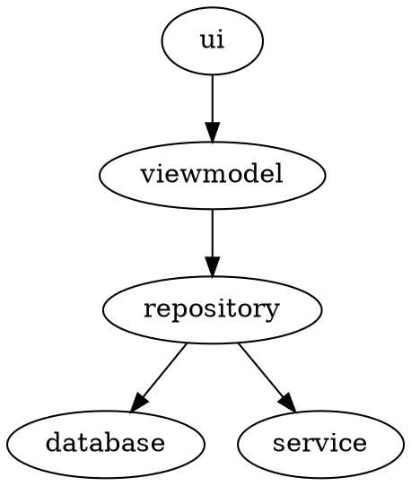

# Sunflower

## 特点
* 基于android jetpack实现的一个应用

## 模块化

### 模块分类
* 界面类： ui, viewmodel,
* 数据类： repository
* 基础类： database, service

### 关系图

## 数据存储
* 数据保存在数据库中
* 数据表：plants, garden_plantings

### plants
* 存储所有的植物信息

| 字段名 |  含义  |
| -- | -- | 
| id | 唯一标识 | 
| name | 植物名字 |
| description | 描述信息 | 
| wateringInterval | 浇水周期，单位：天 |
| imageUrl | 图片链接 | 

### garden_plantings
* 存储植物的种植信息

| 字段名 |  含义  |
| -- | -- | 
| plant_id | 外键，连接到plants表的id字段|
| plant_date | 植物的种植时间 |
| last_watering_date | 植物最近一次的浇水时间 |

## 界面
* 组成：一个activity, 多个fragment

### GardenActivity
* 布局 -- activity_garden
    * 使用FragmentContainerView来显示fragment
    * 加载导航图 nav_garden，显示HomeViewPagerFragment

### HomeViewPagerFragment
* 功能：显示多标签页
* 布局 -- fragment_view_pager
    * 使用ViewPager2来显示多个子fragment
    * 使用CollapsingToolbarLayout显示标题栏
    * 使用TabLayout显示tab标题
* 适配器 -- SunflowerPagerAdapter
    * 用于提供子fragment
    * 连接上ViewPager2

### GardenFragment
* 功能：显示种植在花园中的植物
* 布局 -- fragment_garden
    * 使用RecyclerView来显示植物列表
* 适配器 -- GardenPlantingAdapter
* 视图模型 -- GardenPlantingListViewModel
    * 从GardenPlantingRepository中获取数据

### PlantListFragment
* 功能：显示所有的植物
* 布局 -- fragment_plant_list
    * 使用RecyclerView来显示植物列表
* 适配器 -- PlantAdapter
* 视图模型 -- PlantListViewModel
    * 从PlantRepository中获取数据

### PlantDetailFragment
* 功能：显示植物的详情信息
* 布局 -- fragment_plant_detail
    * 使用CollapsingToolbarLayout显示标题栏
    * 使用ConstraintLayout显示内容
* 视图模型 -- PlantDetailViewModel
    * 从PlantRepository中获取数据
    * 向GardenPlantingRepository中添加数据

### GalleryFragment
* 功能：显示指定植物的照片
* 布局 -- fragment_gallery
    * 使用RecyclerView来显示照片
* 适配器 -- GalleryAdapter
* 视图模型 -- GalleryViewModel
    * 从UnsplashRepository中搜索照片

## 数据层

### UnsplashRepository
* 功能：获取指定植物的分页照片
* 设计：
    * 利用retrofit2库从unsplash网站获取图片
    * 利用paging库进行分页处理
* 结构：
    1. UnsplashPagingSource 得到分页加载结果PagingSource.LoadResult
    1. UnsplashService 得到服务器原始数据 UnsplashSearchResponse